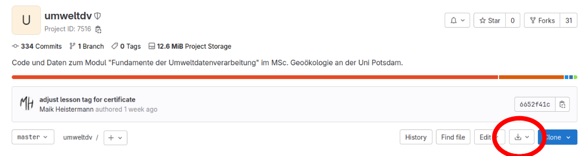

# Meine Python-Arbeitsumgebung

## Installiere Miniforge und Python-Pakete

Die Installation führt uns gleich an die Kommandozeile heran. Zunächst installieren wir Miniforge.
Dies ist, einfach gesagt, ein Paketmanager für Python, hinter dem sich die Software `conda` verbirgt. 

1. Installiere Miniforge. Lade dazu den passenden Installer für Dein Betriebssystem unter [diesem Link](https://conda-forge.org/download/) herunter, führe diesen aus (auf MS Windows z.B. durch Doppelklick) und folge den Anweisungen.

   **Achtung Windows-User:** Wähle unbedingt die Option "Add Anaconda to my PATH environment variable" aus, auch wenn diese nicht empfohlen wird. Auch die anderen Optionen sollten angewählt werden, so wie im folgende Bild:
   
   
   
   Außerdem sollte man üblicherweise nur für den eigenen Nutzer installieren (erfordert keine ausgedehnten Admin-Rechte)
   
   **Hinweise für Mac-User:** [https://kirenz.github.io/codelabs/codelabs/miniforge-setup/](https://kirenz.github.io/codelabs/codelabs/miniforge-setup/)

2. Nun lernen wir ein geniales Feature von Miniforge kennen: die sog. "`conda` environments".
   Mit einem Befehl kann man eine neue "Umgebung" (environment) erstellen, ohne dabei befürchten zu müssen, dass
   die bisherige Umgebung dadurch beschädigt wird. Dies mag jetzt erstmal abstrakt klingen...aber es ist durchaus nicht ungewöhnlich,
   dass die Installation eines Pakets die Funktionalität anderer Pakete beeinträchtigt. Aber genug jetzt, wir erstellen einfach
   eine neue Umgebung names `umweltdv`. Öffne dazu ein Terminalfenster (siehe [hier](https://tutorial.djangogirls.org/en/intro_to_command_line/) für Hinweise unter Windows, MacOS und Linux) und führe den folgenden Befehl aus:
   
   `$ conda create --name umweltdv python=3.11`

3. Immer, wenn Ihr mit dieser neuen Umgebung etwas anstellen wollt, müsst Ihr sie über das Terminal aktivieren. 
   Vielleicht wird dies der häufigste Befehl, den Ihr in diesem Kurs ausführen werdet...
   
   `$ conda activate umweltdv`
   
   (Falls Ihr unter Windows in der Git Bash unterwegs seid, gibt es evtl. den Fehler,
   dass `conda activate` nicht zur Verfügung stehe. Führe in diesem Fall den Befehl
   `conda init bash` aus, schließe das Terminal und versuche es nochmal.

4. Jetzt installieren wir all die Pakete, die wir (voraussichtlich) in diesem Kurs brauchen werden... in einem Rutsch. **Achtung:** Dieser Schritt kann u.U. etwas länger dauern. Das liegt daran, dass der Paketmanager all die Abhängigkeiten zwischen den Paketen verstehen und auflösen muss. Air nutzen dafür den Befehl `mamba` (anstatt `conda` --> IT-Humor). Der Befehl `mamba` ist wie `conda`, aber viel schneller.

   `(umweltdv) $ mamba install numpy scipy pandas matplotlib jupyterlab h5py netCDF4 geopandas rasterio xarray` 
   
   Was das alles für Pakete sind, werden wir Stück für Stück ergründen. 
   Für den Augenblick freuen wir uns, was wir schon alles geleistet haben.
   
   

## Hole Dir die Kursmaterialien auf Deinen Rechner

Wir haben alles, was Ihr für diesen Kurs an Material braucht, in einem zentralen Repository abgelegt: [https://gitup.uni-potsdam.de/umweltdv/umweltdv](https://gitup.uni-potsdam.de/umweltdv/umweltdv).

Den Inhalt könnt Ihr Euch einfach über den Download-Button als `zip`-Archiv runterladen. 
Speichert und entpackt das Archiv an einem geeigneten Speicherort auf Eurem Rechner. Nennt die Verzeichnisebene oberhalb
der eigentlichen Inhalte (also oberhalb der Verzeichnisse `01_environment`, `02_dataframe_basic_vis`, ...) der
Konsistenz wegen am Besten `umweltdv`.



In der [letzten Lektion](../../07_git/Beschaffen.md) lernen wir auch noch einen anderen Weg kennen, wie Ihr ein `git`-Repository einschließlich seiner "History" auf Euren Rechner "klonen" könnt - aber dazu mehr in ein paar Wochen.

## Starte `jupyter` und los geht's...

Wir gelangen nun in die heiße Vorbereitungsphase. In Kürze werden wir Eure Arbeitsumgebung starten...

Wenn nicht schon geschehen, öffnet im Verzeichnis `umweltdv`, welches die Kursinhalte enthält, ein Terminalfester. 
Unter Windows geht das einfach: im Windows Explorer in das Verzeichnis navigieren, dann in der Adresszeile oben `cmd` eingeben und `Enter` drücken.
[Hier](https://www.maketecheasier.com/launch-terminal-current-folder-mac/) gibt es Hinweise für Mac-User.

Nun aktiviert Eure `conda`-Umgebung `umweltdv` und startet `jupyter`. `jupyter`?? Das ist das Werkzeug, in dem wir 
Python-Code schreiben und ausführen werden. Ein sehr mächtiges Werkzeug, das Ihr in den kommenden Wochen ausführlich
kennenlernen werdet. Also:

```
$ conda activate umweltdv
(umweltdv)$ jupyter lab
```
Der letzte Befehl sollte ein Browserfenster öffnen, in welchem Ihr die Verzeichnisstruktur im Verzeichnis `umweltdv` abgebildet seht.


 
Wechsle nun in den `File Browser` (Ordner-Symbol ganz links) und öffne das Verzeichnis
`01_environment`. Lege eine Kopie der Datei `tour-de-python.ipynb` an: 
Mit rechter Maustaste (Kontextmenü) auf die Datei, dann `Duplicate` wählen.


**Warum solltest Du in diesem Kurs immer eine Kopie eines Notebooks anlegen, bevor
Du darin arbeitest?**

Der Grund ist, dass die Dozierenden im Repository `umweltdv/umweltdv`
manchmal Inhalte ändern/anpassen/korrigieren. Darum kann es erforderlich sein, dass Du Dir 
diese aktualisierten Inhalte nochmal runterlädst. Damit diese Dateien nicht in Konflikt 
mit den von Dir bereits bearbeiteten jupyter-Notebooks geraten, ist es besser, vor der
Bearbeitung eine Kopie anzulegen.

Klicke nun also auf die neue Datei `tour-de-python-Copy1.ipynb` und weiter geht's
[im Notebook](tour-de-python.html).

## Schluss machen!

Wenn Ihr jupyter schließen möchtet, speichert zunächst Euer Notebook ab und
schließt das Browserfenster. Im jupyterlab-Filebrowser seht Ihr allerdings das
eben noch geöffnete Notebook noch mit einem grünen Punkt. Das bedeutet: 
Es ist noch aktiv. Ihr könntet jetzt also das Notebook wieder öffnen und 
weiter dran arbeiten. Um das Notebook ausdrücklich zu deaktivieren: 
rechte Maustaste --> "Shut Down Kernel".

Es bleibt jedoch noch das Terminalfenster, über welches Ihr die jupyter-Session
mit dem Befehl `jupyter notebook` gestartet habt. Ihr könnt das Fenster einfach
schließen, um die Session zu beenden. Der saubere Weg (auch wenn Ihr im Terminal
weiterarbeiten möchtet) ist jedoch, die Session im Terminal mit der Tastenkombination
`Strg + C` zu beenden.


## Legacy: Hinweise für Nutzer:innen von `notebook` anstatt `jupyterlab`

`jupyterlab` ist die aktuell verbreitete `jupyter`-Implementierung und wird
in diesem Kurs erstmalig ab 2024/25 als Standard empfohlen. Diejenigen, die jupyter 
noch über das Paket `notebook` installiert haben, müssen einige zusätzliche Schritte
unternehmen, um in den Genuss von "Collapsible Headings" und TOCs zu kommen. Bitte
zunächst jupyter beenden, dann:

```
$ conda activate umweltdv
(umweltdv)$ conda install -c conda-forge jupyter_contrib_nbextensions
(umweltdv)$ jupyter notebook
```

Auf Deinem Bildschirm solltest Du nun in der oberen Zeile einen Reiter namens 
`Nbextensions` sehen. Bitte draufklicken. Diese `Nbextensions` bieten jede Menge
kleiner Helferlein. Wir wollen zwei davon aktivieren (indem wir die Checkboxen anklicken):

- "Collapsible Headings" brauchen wir, um die Lösungen zu kleinen Aufgaben während 
des Seminar aus- und einklappen zu könnnen.
- "Table of Contents(2)" brauchen wir, um im Notebook ein navigierbares 
Inhaltsverzeichnis als Sidebar einblenden zu können.


Bei einigen Nutzer:innen wird der Reiter mit den `Nbextensions` leider nicht angezeigt.
Diese müssen in ihrem conda environment über das Terminal die benötigen Extensions
aktivieren (einmalig). Dafür jupyter beenden und dann:

```
$ conda activate umweltdv
(umweltdv)$ conda install -c conda-forge jupyter_contrib_nbextensions
(umweltdv)$ jupyter nbextension enable toc2/main 
(umweltdv)$ jupyter nbextension enable collapsible_headings/main
(umweltdv)$ jupyter nbextension enable nbextensions_configurator/tree_tab/main
```
Die letzte Zeile sorgt hoffentlich auch dafür, dass beim Neustart von `jupyter`
nun auch der `Nbextension`-Reiter angezeigt wird.

