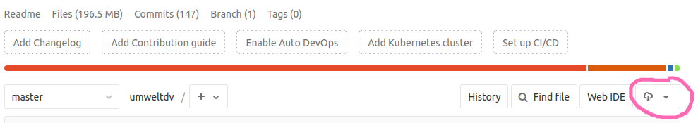
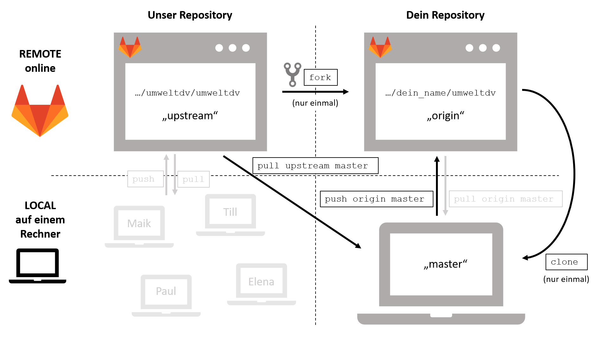
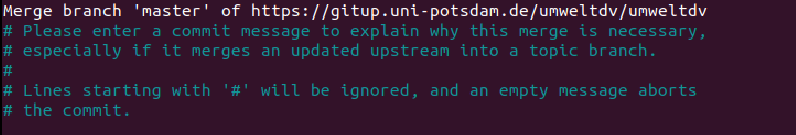

# Der Workflow für diesen Kurs: Ressouren beschaffen und aktuell halten

Wir haben uns ja eingangs schon gerechtfertigt, warum wir Dir ein Technikmonster
wie `git` bereits zu Beginn des Kurses überhelfen.

Die Ressourcen, mit denen Du in diesem Kurs arbeiten wirst, sind v.a. Daten,
R-Dateien (für R) und jupyter Notebooks (für Python). Wir halten und entwickeln
all diese Ressourcen in einem zentralen Repository: 
[https://gitup.uni-potsdam.de/umweltdv/umweltdv](https://gitup.uni-potsdam.de/umweltdv/umweltdv).

Schaut Euch in diesem Repository mal die History an (`Repository --> Commits`).
Ihr seht: Da ist ganz schön was in Bewegung.

## Wie kommt Ihr nun an diese Ressourcen?

### Option 1: Runterladen, fertig.

Es gibt die Möglichkeit, ein Repository schlicht und einfach auf Euren Rechner
zu runterzuladen. Es gibt dazu einen Download-Button:



Wenn alle Stricke reißen, könnt Ihr das jederzeit machen. Aber was macht Ihr,
wenn die Dozierenden etwas an den Ressourcen ändern? In ein neues Verzeichnis
runterladen (`umweltdv.v2/...`) - klingt nach unserem
[Einstiegsbild](http://phdcomics.com/comics/archive/phd101212s.gif). 

Schöner wäre es doch, ein Verzeichnis zu haben, das Ihr nach Bedarf aktualisieren
könnt. Natürlich mit `git`.

### Option 2: Die Gelegenheit nutzen - `git` anwenden!

Stattdessen möchten wir Euch einen Workflow vorschlagen, mit dem Ihr Eure eigenen
Änderungen und die Kursmaterialien effizient zusammenhalten könnt. Dies ist 
vielleicht noch kein professioneller `git`-Workflow, aber es kommt nahe dran und
wird Euch Gelegenheit geben, Routine darin zu sammeln.

## Euer `git`-Workflow

Das Setup lässt sich wir folgt zusammenfassen:

- Erstelle Deinen persönlichen *Fork* vom Kursrepository
- Klone den Fork
- Arbeite lokal nur auf Kopien der Originaldateien und lasse die Originale unangetastet.
- Synchronisiere Dein lokales Repository mit Deinem Fork auf GitLab (`add`, `commit`, `push`)
- Synchronisiere die Originaldateien in Deinem lokalen Repository vor jedem Kurstermin mit dem 
zentralen Kursrepository via `pull`.

Der letzte Schritt - der `pull`-Befehl - ist die eigentliche Neuheit. Bislang hast
Du nur mit `push` Änderungen auf Deinen Fork geeschoben. Wir schauen uns daher
den letzten Schritt etwas genauer an. Dafür nutzen wir zunächst wieder unser
Repository `git-lernen`.

## Lokales Repository mit einem "remote" synchronisieren

Öffnet ein Terminal oder die Git Bash in Eurem lokalen Respository `git-lernen`.
Stellt zunächst mit `git status` sicher, dass es keine uncommiteten Änderungen gibt.
Falls noch Änderungen offen sind:

```
$ git add .
$ git commit -m "Schnell irgendwas committen"
```

Nun schauen wir uns mal an, woher `git` eigentlich weiß, wohin ge`push`t wird, wenn
Ihr einen `push`-Befehl ausführt. Wir nutzen dazu:

```
$ git remote -v
origin	https://gitup.uni-potsdam.de/heisterm/git-lernen.git (fetch)
origin	https://gitup.uni-potsdam.de/heisterm/git-lernen.git (push)
```

Aha. Wir verstehen jetzt, woher `git` weiß, wohin es geht, wenn ich `git push origin master`
eingebe. Der Eintrag mit `fetch` hingegen sagt `git`, wo es nachschauen muss, 
wenn ich einen `pull`-Befehl ausführe. `pull` heißt soviel wie: Schaue in einem
anderen Repository (typischerweise auf eine Plattform wie GitLab oder GitHub) nach
Änderungen und "merge" (also "verschmelze") diese mit meinem lokalen Repository.

Nun willst Du aber Dein lokales Repository nicht mit Deinem eigenen Fork synchronisieren,
sondern mit dem Repository, aus dem Du ursprünglich geforkt hast. Die Adresse für 
diesen "remote" müssen wir `git` noch beibiegen. Wir nennen es nicht `origin`, sondern
`upstream` (typische Konvention):

```
$ git remote add upstream https://gitup.uni-potsdam.de/umweltdv/git-lernen.git
```

Ich werde nun eine neue Datei namens `deins.md` in mein Repository
[https://gitup.uni-potsdam.de/umweltdv/git-lernen.git](https://gitup.uni-potsdam.de/umweltdv/git-lernen.git)
 pushen.

*Achtung: Wir sitzen live zusammen...bitte wartet, bis ich `deins.md` gepush habe!*

Die Datei `deins.md` möchtest Du nun gern in Deinem lokalen Repository haben. Das geht so:

```
$ git pull upstream master
```

Je nach Art der Änderungen, die Ihr Euch über den `pull` reinholt, fragt `git` Euch nach einer
ausdrücklichen Beschreibung dieses "merge" (im Sinne einer `commit`-Nachricht) oder fügt selbst
eine entsprechende Nachricht ein ("Merge commit"). 

Nun schau mal in Dein lokales Repository: Ist `deins.md` da?

Und jetzt nochmal Altbekanntes: Du möchtest nun diese Änderung in Deinen Fork
by GitLab schieben:

```
$ git push origin master
```

Voila - alles synchron?!


## Jetzt wirklich... workflow für den Kurs aufsetzen!

### Fork

Erstelle Deinen persönlichen *Fork* vom [Kursrepository](https://gitup.uni-potsdam.de/umweltdv/umweltdv)

### Clone
Klone den Fork auf Deinen Rechner. Öffne dafür die Bash in einem Zielverzeihnis Deiner Wahl.
Dann

`$ git clone https://gitup.uni-potsdam.de/DEIN-UP-NUTZER/umweltdv`.

Je nach Internetverbindung kann das eine ganze Weile dauern, da sich teils große Datensätze im Repository befinden.
Navigigiere mit der Bash nun in das Repository:

`$ cd umweltdv`.

### Remote einstellen

Füge das zentrale Repository als remote namens `upstream` hinzu:

```
$ git remote add upstream https://gitup.uni-potsdam.de/umweltdv/umweltdv.git
$ git remote - v
```

Der letzte Befehl sollte Dir als remote `origin` Deinen eigenen Fork und als
remote `upstream` das zentrale Kursrepository ausgeben.

### Konflikte vermeiden: Nur auf Kopien arbeiten!

Arbeite lokal nur auf Kopien der Originaldateien und lasse die Originale unangetastet.
Wenn Du z.B. den Python-Kurs belegst und beim nächsten Mal mit der Datei
`umweltdv/02_environment/python/tour-de-python.ipynb` arbeiten möchtest: Lege eine
Kopie an (z.B. `tour-de-python_Copy.ipynb`) und arbeite mit dieser.

### Dein Repository pflegen!

Praktiziere den erlernten `git` Workflow, um Deine eigenen Änderungen in die
lokale History einzupflegen und Deinen Fork auf GitLab aktuelle zu halten:

```
$ git status
$ git add .
$ git commit -m "Lektion 1 fertig bearbeitet."
$ git push origin master
```

Synchronisiere die Originaldateien regelmäßig mit dem `upstream`:

```
$ git pull upstream master
$ git push origin master
```

Auch hier müsst Ihr nach dem `pull` ggf. eine Merge-Nachricht eingeben (merge commit). 
Wenn Ihr dabei in einem komischen Terminalfenster landet, schaut bitte Euch bitte
nochmal [diesen Abschnitt](#bestaetigen-der-merge-nachricht-nach-einem-pull).

### Nochmal auf einen Blick

Hier nochmal der Ablauf des ganzen auf einen Blick:




### Gib nicht auf!

Auch wenn Dir das alles furchtbar vorkommt: Gib nicht auf! Mach weiter! Auch wenn es weh tut!


## Bestaetigen der Merge-Nachricht nach einem Pull

Ein typisches Szenario: Du führst `git pull upstream master` aus und `git` fordert Dich auf,
eine Merge-Nachricht einzugeben bzw. die von git vorgeschlagene Merge-Nachricht (so was wie
`Merge branch 'master' of https://gitup.uni-potsdam.de/umweltdv/umweltdv`) zu bestätigen
und abzuspeichern.

Du siehst aber nur ein Terminalfenster, so in der Art wie im folgenden Bild:



Was nun? Du wollt einfach nur die vorgeschlagene Nachricht bestätigen. Was Du siehst,
ist der Default-Editor, der mit dem git-client unter Windows geliefert wird.
Er heißt `vim` und ist extrem spröde.

**Um die Merge-Nachricht zu bestätigen, drückst Du erst die Escape-Taste und anschließend: `:wq`.**

Das `w` steht für "write" (also quasi abspeichern) und `q` steht für "quit".

Also nochmal: `ESC --> :wq`

Anschließend solltet Ihr wieder das bekannte Prompt der Git-Bash sehen.

Wenn Dich das auf die Dauer stört, kannst Du zumindest unter Windows Notepad++
als Default-Editor auswählen. Dafür musst zunächst Notepad++ installieren. 
Suche anschließend den Pfad, unter dem die ausführbare Datei `notepad++.exe` liegt.

Führe dann in der git-Bash folgenden Befehl aus:

```
$ git config --global core.editor "'C:/Program Files (x86)/Notepad++/notepad++.exe' -multiInst -notabbar -nosession -noPlugin"
```

Achte darauf, den richtigen Systempfad zur `notepad++.exe` anzusetzen. Nutze Forward-Slashes!


