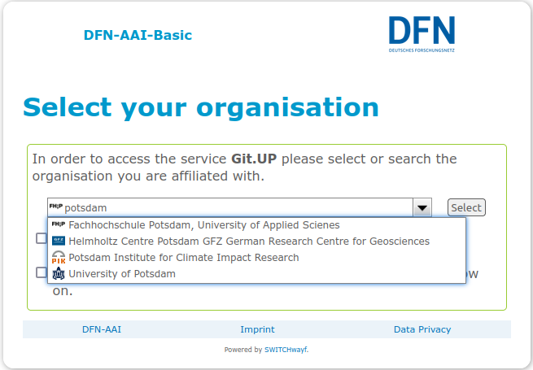

# Vorbereitung Deiner Git-Umgebung

Bevor wir loslegen, müssen wir die `git`-Umgebung auf Deinem Rechner vorbereiten
und Dich bei Git.UP registrieren.


## Git installieren und einrichten

Auf dieser Seite findest Du Anleitungen für die Installation von `git` unter
Linux, Mac und Windows: 
[https://git-scm.com/book/en/v2/Getting-Started-Installing-Git](https://git-scm.com/book/en/v2/Getting-Started-Installing-Git).

Unter [diesem Link](https://phoenixnap.com/kb/how-to-install-git-windows) gibt es noch einen Windows-spezifischen Walk-through durch die 
Installationsprozedur.

Öffne nach der Installation bitte die Git Bash und definiere Nutzernamen
und E-Mail-Adresse.

```
$ git config --global user.email "you@example.com"
$ git config --global user.name "Your Name"
```


## Vorbereitung 2: Bei Git.UP registrieren

Öffne in Deinem Browser die Adresse [https://gitup.uni-potsdam.de](https://gitup.uni-potsdam.de).

Git.UP ist eine von der Uni Potsdam betriebene Instanz von GitLab. GitLab wiederum ist
eine Plattform für Softwareentwicklung, die unter anderem die Speicherung und
das Management von "Repositories" erlaubt. Lösungen wie GitLab oder das noch
bekanntere [GitHub](https://github.com) sind heutzutage Dreh- und Angelpunkte kollaborativer 
(also gemeinschaftlicher) Softwareentwicklung.

Damit Du in diesem Kurs GitLab bzw. Git.UP nutzen kannst, musst Du Dich einmalig
dort registrieren. Das Tolle: Du brauchst dafür keinen Extra-Account, sondern kannst
Dich direkt mit Deinem UP-Account registrieren und anmelden.


