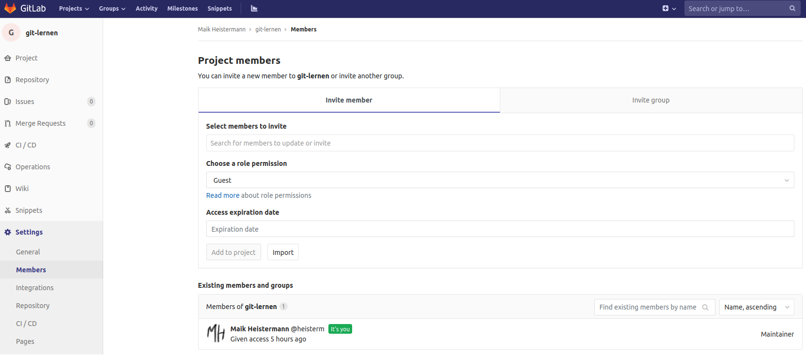

# Mit Hilfe von `git` und GitLab zusammen arbeiten

Wir haben es im Rahmen dieser Veranstaltung noch nicht geschafft zu zeigen, wie
man `git` in Verbindung mit GitLab nutzt, um gemeinsam an Projekten zu arbeiten.
Das ist eigentlich nicht so schwer: Irgendwie müsste man die Änderungen, die man
in seinem Fork gemacht hat, wieder zurück in das ursprüngliche Respository bekommen.
Als Eigentümer des ursprünglichen Respositorys möchte man aber nicht unbedingt,
das x-beliebige Menschen ihren Code in das Repository pushen (hier war das ursprüngliche
Respository [https://gitup.uni-potsdam.de/umweltdv/git-lernen.git](https://gitup.uni-potsdam.de/umweltdv/git-lernen.git)).

Dafür gibt es nun zwei Lösungen: Entweder man vertraut bestimmten Menschen, dass
sie keine Mist bauen und räumt ihnen Schreibrechte in dem Repository ein. Das geht
in GitLab unter `Settings -> Members` im linken Sidebar.

Oft möchte man aber gern Entwicklungen Dritter motivieren, ihnen aber dennoch keine
Rechte im eigenen Repository einräumen. Hier hat sich ein wichtiger Mechanismus
der kollaborativen Softwareentwicklung gebildet: in der GitHub-Welt heißt dieser
"Pull-Request", in der GitLab-Welt "Merge Request". Vereinfacht gesagt kann man
einen "Antrag" (Request) an den Eigentümer des Repository stellen, die eigenen
Änderungen hineinzu**merge**n.

Als Beispiel, wie so etwas abläuft, schauen wir uns mal die Pull Requests
des Python-Pakets `wradlib` an, einer Bibliothek zur Verarbeitung von Niederschlagsradardaten:
[https://github.com/wradlib/wradlib/pulls](https://github.com/wradlib/wradlib/pulls).

Für eine ausführliche Behandlung und vor allem Übung des Themas fehlt uns in dieser
Veranstaltung leider die Zeit. [Hier](https://www.earthdatascience.org/courses/intro-to-earth-data-science/git-github/github-collaboration/)
findet Ihr eine Einführung in das Thema. Außerdem gibt es dazu eine [Fingerübung](Fingeruebungen/)
