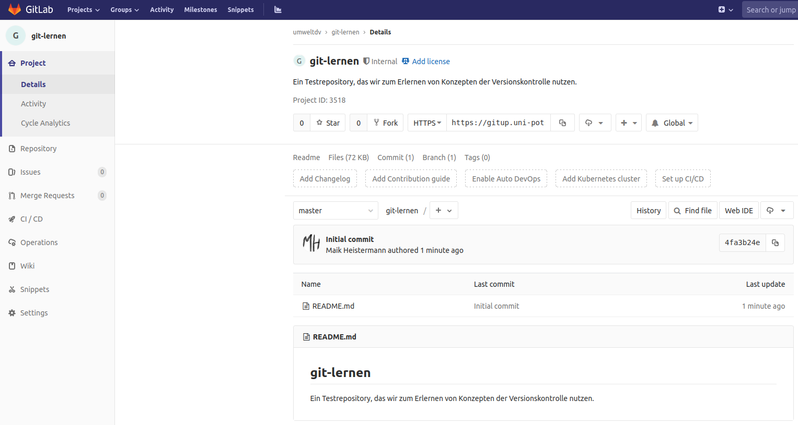
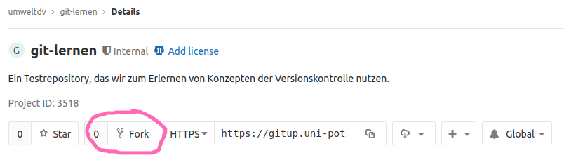
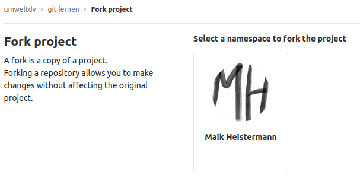
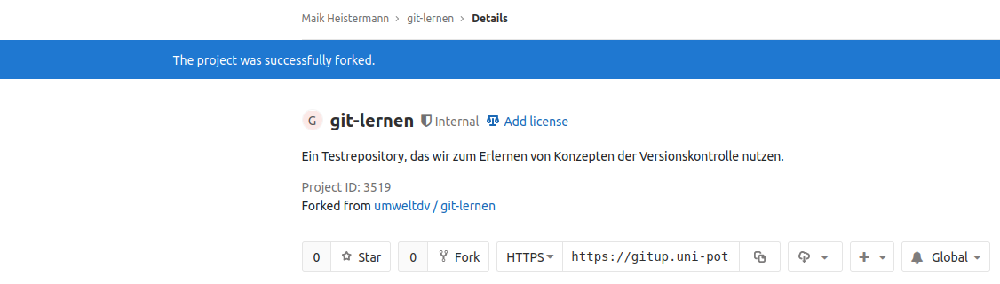
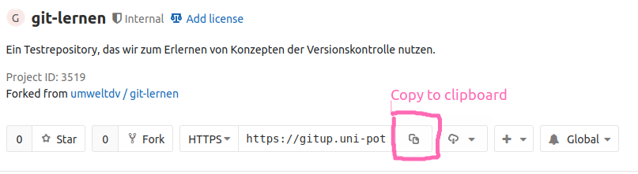
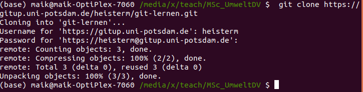
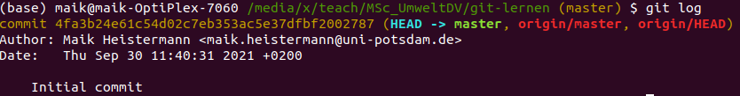
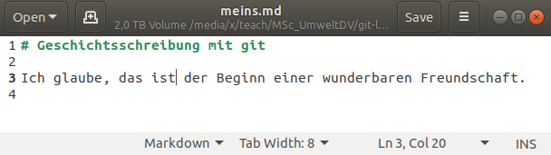
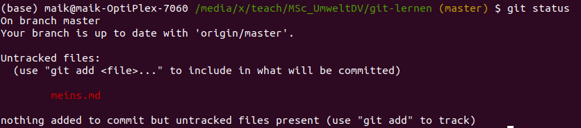
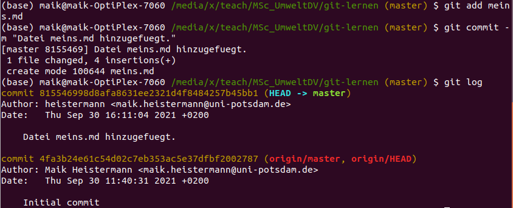

# Die volle Breitseite

## Ein kompletter Workflow `fork`, `clone`, `add`, `commit`, `push`

Bevor wir uns das Konzept der Versionskontrolle weiter erarbeiten, wollen wir
lieber die Technik an einem Beispiel anwenden.

Ein "Repository" ist so etwas wie ein Projektverzeichnis, in dem ein einzelnes Dokument
oder aber auch eine Sammlung von Dokumenten oder Codedateien liegen kann.

Um bestimmte Abläufe kennenzulernen und zu üben, nutzen wir das bereits existierende
Repository [git-lernen](https://gitup.uni-potsdam.de/umweltdv/git-lernen). Bitte mal
im Browser öffnen.



Schau Dich ruhig mal um - evtl. sieht das Repository mittlerweile ein bisschen
anders aus als auf dem Bild. Jetzt gerade enthält das Repository nur eine Datei
namens `READM.md`. Das `md` steht für Markdown. Markdown ist eine sogenannte 
Auszeichnungssprache, die wir später noch besser kennenlernen werden. Diese
Webseite habe ich übrigens auch in Markdown geschrieben.

## Fork

Ich möchte Dir aber keine Schreibrechte auf meinem Repository `umweltdv/git-lernen`
geben. Stattdessen legst Du innerhalb von GitLab eine Kopie des Repositories an. 
Innerhalb dieser Kopie hast **Du** dann alle Rechte. Eine solche Kopie nennt man auch
*Fork* (also Gabel), weil sich damit die Entwicklung des Repositories "aufgabelt",
nämlich in Deinen und meinen Zinken. Erstelle jetzt Deinen Fork, indem Du auf das
`Fork`-Button klickst.



Du musst dann noch Deinen GitLab-Namespace auswählen, in welchem der Fork landen
soll - wahrscheinlich hast Du nur einen...



Der Browser sollte Dir dann nach kurzer Fortschrittsanzeige Deinen Fork
in Deinem eigenen Namespace zeigen. Yay.



Das ist nun Dein erstes "eigenes" Repository auf GitLab. In dieses "remote" willst
Du all die Änderungen einfügen, die Du *lokal* an dem Projekt vornimmst. Aber dafür 
musst Du das Projekt erstmal auf Deinen lokalen Rechner bekommen. Dafür geht es
weiter mit `git clone`.

## git clone

Bewege Dich auf Deinem eigenen Rechner in ein Verzeichnis, in dem Dein Fork
landen soll (also z.B. das Verzeichnis, in dem Du den ganzen Kram aus diesem Modul
ablegst). Öffne in diesem Verzeichnis die *Git Bash*. Unter Windows sollte das
einfach mit dem Kontextmenü über die rechte Maustaste gehen. Unter Linux öffnest
Du einfach ein Terminal in dem Verzeichnis.

Im Browser kannst Du die Adresse des Repositories kopieren und dann in die
Git Bash zusammen mit dem Befehl `git clone` einfügen.

 

In der URL in der folgenden Befehlszeile müsste UPNUTZER also durch Deinen
Benutzernamen ersetzt werden:

`$ git clone https://gitup.uni-potsdam.de/UPNUTZER/git-lernen.git`

Anschließend wirst Du nach den Credentials Deines UP-Accounts gefragt und der
Download erfolgt.



Wirf nun einen Blick in Dein Verzeichnis - dort sollte nun das Unterverzeichnis
`git-lernen` aufgetaucht sein. Vergleiche den Inhalt des Unterverzeichnisses mit dem,
was Du im Browser in Deinem GitLab-Fork siehst.

Wechsle mit der Git Bash nun in das Verzeichnis `git-lernen` (`cd` steht für
change directory) und lass Dir den Inhalt anzeigen:

```
$ cd git-lernen
$ ls -a
.  ..  .git  README.md
```

Die Datei `README.md` ist der Inhalt des Repositories. In der versteckten Datei
`.git` steht alles drin, was `git` sich merken muss: welche Dateien werden getrackt,
welche Änderungen gab es wann und durch wen? 

## Code ändern und `git` darüber informieren: `add` und `commit`

Apropos Änderungen: Was gab es denn in dem Repository bislang für Änderungen?
Die Abfolge dieser Änderungen nennt man auch die *history*. Schauen wir uns
die bisherige *history* an:

```
$ git log
```



Bis zum gegenwärtigen Zeitpunkt gibt es nur einen einzigen "Commit". Was ist ein *commit*?
Ein *commit* ist ein neuer Eintrag in der *history*: Mit einem *commit* teilst Du
`git` mit, dass es sich Deine Änderungen gegenüber der vorherigen Version offiziell
merken soll. Wenn Du Änderungen `commit`est, musst Du immer eine kurze Mitteilung
hinzufügen, welche die Änderungen beschreibt. Das ist die *commit message*.
Diese *commit message* lautet für den ersten Commit in diesem Repository originellerweise "Initial commit".

Nimm nun eine Änderung am Repository vor. Was das für eine Änderung ist, bleibt
Dir überlassen. Du könntest z.B. eine neue Markdown-Datei erstellen. Nutze einen
Texteditor (z.B. Notepad++) und erstelle eine neue Textdatei (z.B. `meins.md`)
im Verzeichnis `git-lernen`. Ich habe dafür unter Ubuntu den Editor *gedit* genutzt.



Speichern nicht vergessen. Jetzt schau Dir an, ob `git` von Deinem Schaffen Notiz
genommen hat:

```
$ git status
```



`git` hat also gemerkt, dass es eine neuen Datei namens `meins.md` gibt. Diese
Datei ist aber noch "untracked", ist also noch nicht Teil des `git` Repositories,
obowhl sie im gleichen Verzeichnis liegt. Das Hinzufügen zum Repository erfolgt
in zwei Schritten: `add` fügt die Datei der sog. "Staging Area" hinzu, `commit`
fügt dann alle Dateien, die sich in der Staging Area befinden, der git history hinzu.
Das Flag `-m` markiert die *commit message*. 

```
$ git add meins.md
$ git commit -m "Datei meins.md hinzugefuegt."
```

Jetzt schauen wir uns nochmal die History an:

`$ git log`




## Letzter Schritt: `push` Deine Änderungen in Dein Repository auf GitLab

Du hast jetzt eine laufende lokale Versionskontrolle. Wenn Du es für sinnvoll
hältst, kannst Du nun Deine Änderungen auf Dein GitLab-Repository schieben (`push`en).

`$ git push origin master`

Du könntest auch nur `git push` verwenden, aber wenn Du mit mehreren Remote-Repositories
und branches arbeitest, empfiehlt es sich, remote und branch explizit anzugeben.

Schaue nun im Browser auf Deinem GitLab-Repository nach, ob Deine Änderungen angekommen sind.

## Recap

So, das war Dein erster vollständiger Durchlauf durch einen sogenannten git workflow:

- Fork: Ein repository auf einer Hosting-Plattform wie GitLab in Deinen namespace kopieren.
- `git clone`: ein Repository von einer Plattform in ein lokales Verzeichnis runterladen.
- `git log`: Die bisherige History inspizieren.
- `git status`: Bislang aufgelaufene Änderungen anzeigen
- `git add .`: Alle Änderungen in die Staging Area verschieben
- `git commit -m "Eine aussagekräftige Beschreibung"`: Alle Änderungen auf der 
Staging Area in das Repository `commit`en
- `git push`: Aktuellen Stand des Repositories auf ein remote Repository schieben

**Aufgabe**: Wiederhole diesen Workflow ein paar Mal, um etwas Routine zu bekommen.
Füge Dateien hinzu oder ändere den Inhalt bereits bestehender Dateien. Schaue Dir
jeweils den Output von `git status` an.
