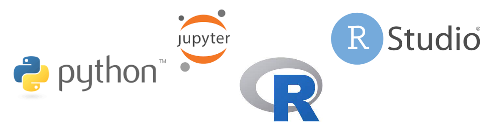

# Level 2: Die Arbeitsumgebung

## Python

- Anleitung zum Einrichten Eurer Arbeitsumgebung ([Link](python/README.md))
- Tour durch Eure neue Python-Umgebung ([Link](python/tour-de-python.html)).
- Python-Übungsaufgaben für diese Lektion ([Link](python/uebung/uebung.html)).

## R

- Anleitung zum Einrichten Eurer Arbeitsumgebung ([Link](R/R_Arbeitsumgebung.html))
- Tour durch Eure neue R-Umgebung ([Link](R/R_kundungstour.html)).
- R-Übungsaufgaben für diese Lektion ([Link](R/exercises02.html)).

## Lernziele

- Wie installiere ich eine Arbeitsumgebung in R oder Python?
- Wie starte ich diese Arbeitumgebung und navigiere darin?
- Erster Kontakt mit der Sprache: Kennenlernen elementarer Konzepte und Funktionen

## Struktur

Das Seminar besteht aus zwei Teilen:

1. Installationsanleitung für [R](R/R_Arbeitsumgebung.html) bzw. [Python](python/README.md)
2. Erkundungstour durch [R/R-Studio](R/R_kundungstour.html) bzw. [Python/jupyter](python/tour-de-python.html)

## Inhalte der Coding-Werkstatt

- Habt Ihr Fragen zu den Inhalten des ersten Seminars? Etwas noch nicht verstanden?
Nutzt die Coding-Werkstatt, um diese Dinge zur Sprache zu bringen. Notiert Euch die
Fragen am Besten vorher!
- Zum ersten Mal: Übungsaufgaben öffnen, bearbeiten, testen und einreichen.
- Vertiefungsaufgabe
