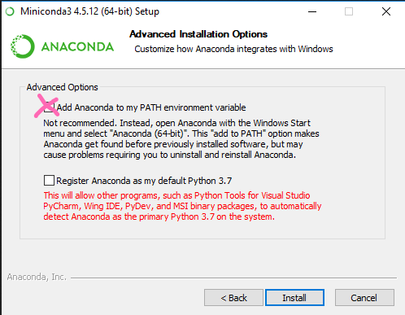
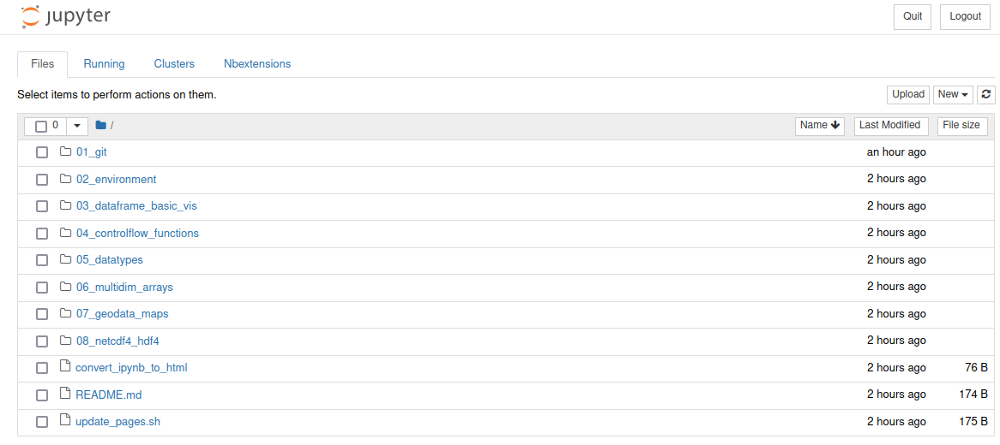
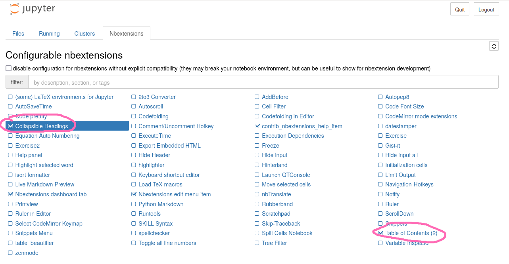
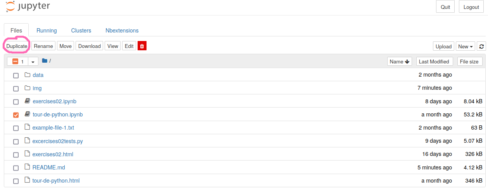

# Meine Python-Arbeitsumgebung

## Installiere Miniconda und Python-Pakete

Die Installation führt uns gleich an die Kommandozeile heran. Zunächst installieren wir Miniconda.
Dies ist, einfach gesagt, ein Paketmanager für Python. 

1. Installiere Miniconda. Folge dazu den Anleitungen unter [diesem Link](https://conda.io/miniconda.html). 

   **Achtung Windows-Nutzer/innen:** Wählt die Option "Add Anaconda to my PATH environment variable" aus, auch wenn diese nicht empfohlen wird. So wie im folgende Bild angedeutet:
   
   

2. Öffne nun ein Terminalfenster (siehe [hier](https://www.digitalcitizen.life/open-windows-terminal/), wie das für Windows-Nutzer*innen geht).
   Nun sind zwei Befehle auszuführen, die `miniconda` sagen, woher es bevorzugt Pakete beziehen soll.
   
   `$ conda config --add channels conda-forge`
   
   `$ conda config --set channel_priority strict`

3. Nun lernen wir ein geniales Feature von Miniconda kennen: die sog. "`conda` environments".
   Mit einem Befehl kann man eine neue "Umgebung" (environment) erstellen, ohne dabei befürchten zu müssen, dass
   die bisherige Umgebung dadurch beschädigt wird. Dies mag jetzt erstmal abstrakt klingen...aber es ist durchaus nicht ungewöhnlich,
   dass die Installation eines Pakets die Funktionalität anderer Pakete beeinträchtigt. Aber genug jetzt, wir erstellen einfach
   eine neue Umgebung names `umweltdv`:
   
   `$ conda create --name umweltdv python=3.10`

5. Immer, wenn Ihr mit dieser neuen Umgebung etwas anstellen wollt, müsst Ihr sie über das Terminal aktivieren. 
   Vielleicht wird dies der häufigste Befehl, den Ihr in diesem Kurs ausführen werdet...
   
   `$ conda activate umweltdv`
   
   (Falls Ihr unter Windows in der Git Bash unterwegs seid, gibt es evtl. einen Fehler,
   dass `conda activate` nicht zur Verfügung steht. Führe in diesem Fall den Befehl
   `conda init bash` aus, schließe das Terminal und versuche es nochmal.

6. Jetzt installieren wir all die Pakete, die wir (voraussichtlich) in diesem Kurs brauchen werden... in einem Rutsch:

   `(umweltdv) $ conda install numpy scipy pandas matplotlib notebook h5py netCDF4 geopandas jupyter_contrib_nbextensions rasterio`
   
   Das kann je nach Internetverbindung eine Weile dauern... 
   
   Was das alles für Pakete sind, werden wir Stück für Stück ergründen. 
   Für den Augenblick freuen wir uns, was wir schon alles geleistet haben.
   
7. Noch eine Kleinigkeit...

   `(umweltdv) jupyter contrib nbextension install --user`
   

## Hole Dir die Kursmaterialien auf Deinen Rechner

Wir haben alles, was Ihr für diesen Kurs an Material braucht, in einem zentralen Repository abgelegt. Dies könntet Ihr jetzt auch runterladen, 
aber wir wissen seid unserem letzten Termin etwas Besseres. 

Ihr könnt in GitLab einen Fork des Repositories [https://gitup.uni-potsdam.de/umweltdv/umweltdv.git](https://gitup.uni-potsdam.de/umweltdv/umweltdv.git)
anlegen und dann mittels `git clone https://gitup.uni-potsdam.de/MeinUPNutzer/umweltdv.git`
in ein lokales Verzeichnis klonen. Ihr werdet beim Klonen nach Nutzernamen und Kennwort gefragt. Benutzt Euren UP-Account (Nutzername ohne `@uni-potsdam.de`) 

Falls Ihr das noch nicht im Rahmen der `git`-Lektion gemacht habt: [Hier](../../01_git/Beschaffen.md)
findet Ihr eine ausführliche Anleitung.


## Starte `jupyter` und los geht's...

Wir gelangen nun in die heiße Vorbereitungsphase. In Kürze werden wir Eure Arbeitsumgebung starten...

Wenn nicht schon geschehen, öffnet im geklonten Arbeitverzeichnis `umweltdv` ein Terminalfester.
Nun aktiviert Eure `conda`-Umgebung `umweltdv` und startet `jupyter`. `jupyter`?? Das ist das Werkzeug, in dem wir 
Python-Code schreiben und ausführen werden. Ein sehr mächtiges Werkzeug, das Ihr in den kommenden Wochen ausführlich
kennenlernen werdet. Nun also:

```
$ conda activate umweltdv
(umweltdv)$ jupyter notebook
```
Der letzte Befehl sollte ein Browserfenster öffnen, in welchem Ihr die Verzeichnisstruktur im Verzeichnis `umweltdv` abgebildet seht.



 
Wir wollen noch einige Einstellungen in `jupyter` vornehmen. Auf Deinem Bildschirm 
siehst Du in der oberen Zeile einen Reiter namens `Nbextensions`. Bitte draufklicken.
Diese `Nbextensions` bieten jede Menge kleine Helferlein. Wir wollen nun vor allem
 zwei davon aktivieren (indem wir die Checkboxen anklicken):

- "Collapsible Headings" brauchen wir, um die Lösungen zu kleinen Aufgaben während 
des Seminar aus- und einklappen zu könnnen.
- "Table of Contents(2)" brauchen wir, um im Notebook ein navigierbares 
Inhaltsverzeichnis als Sidebar einblenden zu können.



Bei einigen Nutzer:innen wird der Reiter mit den `Nbextensions` leider nicht angezeigt.
Diese müssen in ihrem conda environment über das Terminal die benötigen Extensions
aktivieren (einmalig). Dafür jupyter beenden und dann:

```
$ conda activate umweltdv
(umweltdv)$ jupyter nbextension enable toc2/main 
(umweltdv)$ jupyter nbextension enable collapsible_headings/main
(umweltdv)$ jupyter nbextension enable nbextensions_configurator/tree_tab/main
```
Die letzte Zeile sorgt vielleicht auch dafür, dass beim Neustart von `jupyter`
nun auch der `Nbextension`-Reiter angezeigt wird.

Wechsle nun zurück auf den Reiter `Files` und öffne das Verzeichnis
`02_environment`. Lege eine Kopie der Datei `tour-de-python.ipynb` an, indem Du
die Checkbox vor der Datei aktivierst und dann oben auf den Button `Duplicate`
drückst.



**Warum solltest Du in diesem Kurs immer eine Kopie eines Notebooks anlegen, bevor
Du darin arbeitest?**

Der Grund ist, dass die Dozierenden im zentralen Upstream-Repository
manchmal Inhalte ändern/anpassen/korrigieren. Wenn Du diese Änderungen in Dein
Repository `merge`st/`pull`st, kommt es evtl. zu Konflikten mit Deinen eigenen Änderungen. Das
ist zwar nicht weiter schlimm, kann aber etwas mühsam werden. Die Alternative für
`git`-Profis wäre, einen neuen `git`-Branch (z.B. mit `git checkout -b nur-fuer-mich`
anzulegen, in dem Du arbeitest. Dann könntest Du parallel dazu Deinen `master`-Branch
mit dem zentralen Repository synchronisieren und bei Bedarf in Deine eigenen Änderungen
auf `nur-fuer-mich` reinmergen. Aber...das lassen wir erstmal. Lege stattdessen 
immer eine Kopie der Notebooks an, bevor Du sie öffnest und damit arbeitest.

Klicke nun also auf die neue Datei `tour-de-python-Copy1.ipynb` und weiter geht's
[im Notebook](tour-de-python.html).

## Schluss machen!

Wenn Ihr jupyter schließen möchtet, speichert zunächst Euer Notebook ab und
schließt das Browserfenster. In der jupyter-Übersicht seht Ihr allerdings das
eben noch geöffnete Notebook noch "grün" - also aktiv. Ihr könntet jetzt also
das Notebook wieder öffnen und weiter dran arbeiten. Um das Notebook ausdrücklich
zu deaktivieren, könnt Ihr es markieren und dann den "Shutdown"-Button drücken.

Es bleibt jedoch noch das Terminalfenster, über welches Ihr die jupyter-Session
mit dem Befehl `jupter notebook` gestartet habt. Ihr könnt das Fenster einfach
schließen, um die Session zu beenden. Der saubere Weg (auch wenn Ihr im Terminal
weiterarbeiten möchtet) ist jedoch, die Session im Terminal mit der Tastenkombination
`Strg + C` zu beenden.
