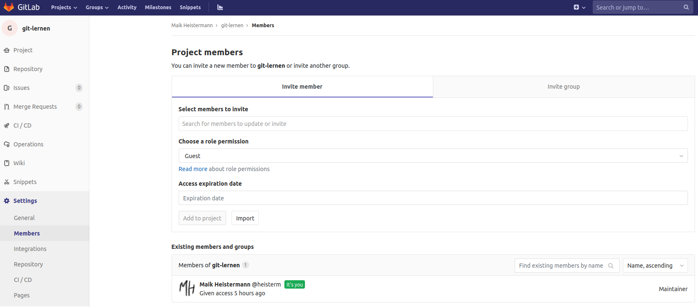

# Mit Hilfe von `git` und GitLab zusammen arbeiten

Wir haben im Rahmen dieser Veranstaltung leider nicht genug Zeit um zu zeigen, wie
man `git` und GitLab nutzen kann, um gemeinsam an Projekten zu arbeiten.
Eigentlich ist das aber gar nicht so schwer: Irgendwie muss man die Änderungen im 
lokalen (eigenen) Repository wieder zurück in das ursprüngliche (gemeinsame) Respository bekommen.
In unserem Beispiel war [https://gitup.uni-potsdam.de/umweltdv/git-lernen.git](https://gitup.uni-potsdam.de/umweltdv/git-lernen.git) 
das ursprüngliche Respository.

Als Eigentümer:in des ursprünglichen Respositorys möchte man aber nicht unbedingt,
das x-beliebige Menschen ihren Code in das Repository pushen. Um dies zu verhindern
gibt es zwei Modelle für eine Zusammenarbeit: einen gemeinsames "remote repository", 
auf dem alle Teammitglieder Schreibrechte haben, oder das sog. "fork-and-pull"-Modell.

## Modell 1: Ein gemeinsames Remote Repository für alle

Das ist meist die einfachste Lösung. Man vertraut bestimmten Menschen, dass
sie keine Mist bauen und räumt ihnen Schreibrechte im Remote Repository ein. Das geht
in GitLab unter `Settings -> Members` im linken Sidebar. 

Dieses Modell der Zusammenarbeit haben wir auch im Respository
`umweltdv/umweltdv` umgesetzt: Jede:r Dozent:in hat einen lokalen Klon des remote,
alle pushen in das gleiche remote repository. Es gibt also gar keine forks.
Jede:r muss dann nur dafür sorgen, das lokale Repository mit dem remote synchron halten. Wenn andere
auf den remote pushen, muss man sich diese Änderungen in das lokale Repository "ziehen"
- der Befehl heißt `git pull`.

## Modell 2: Das "fork-and-pull" Modell

Oft möchte man Entwicklungen Dritter motivieren, diesen Personen aber keine
Rechte im eigenen Repository einräumen. Hier hat sich ein wichtiger Mechanismus
der kollaborativen Softwareentwicklung gebildet: in der GitHub-Welt heißt dieser
"Pull-Request", in der GitLab-Welt "Merge Request". Vereinfacht gesagt kann man
einen "Antrag" (Request) an den Eigentümer des Repository stellen, die eigenen
Änderungen hineinzu**pull**n (bzw. hineinzu**merge**n). So können Entwicklungen
aus den forks in den ursprünglichen Entwicklungsstrang eingepflegt werden.

Als Beispiel, wie so etwas abläuft, schauen wir uns mal die Pull Requests
des Python-Pakets `wradlib` an, einer Bibliothek zur Verarbeitung von Niederschlagsradardaten:
[https://github.com/wradlib/wradlib/pulls](https://github.com/wradlib/wradlib/pulls).

Für eine ausführliche Behandlung und vor allem Übung des Themas fehlt uns in dieser
Veranstaltung leider die Zeit. [Hier](https://www.earthdatascience.org/courses/intro-to-earth-data-science/git-github/github-collaboration/)
findest Du eine Einführung in das Thema. Außerdem gibt es dazu eine [Fingerübung](Fingeruebungen).
